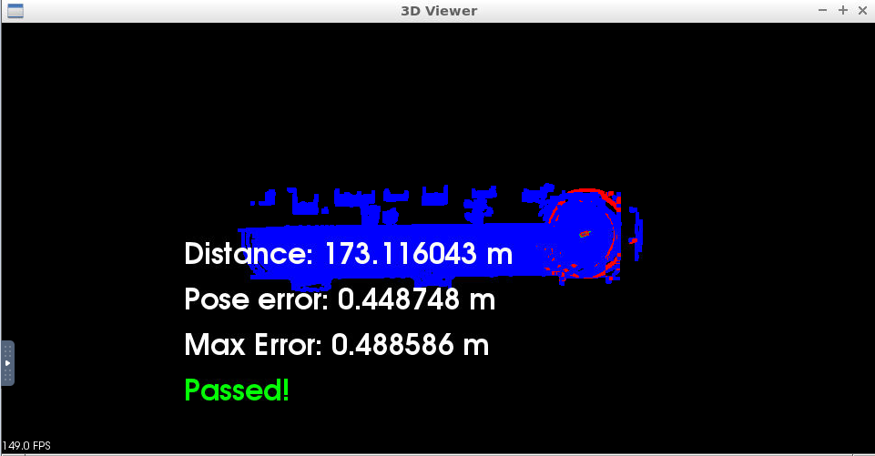

# Scan-Matching-Localization
The goal of this is project is to to localize a car driving in simulation for at least 170m from the starting position and never exceeding a distance pose error of 1.2m. The simulation car is equipped with a lidar, provided by the simulator at regular intervals are lidar scans. There is also a point cloud map map.pcd already available, and by using point registration matching between the map and scans localization for the car can be accomplished. This point cloud map has been extracted from the CARLA simulator.
The project is divided in 3 steps:
- Filter scan using voxel filter
- Find pose transform by using ICP or NDT matching
- Transform the scan so it aligns with ego's actual pose and render that scan
<br>
Regarding the second step I've decided to use ICP matching. I've just modified the c3-main.cpp file, adding a fuction performing IPC (), in order not to increase too much size of the main function.
<br>
As shown in the picture, the pose was never over 0.49 m, well below the given threshold .
<p align="center">
  
</p>

In order to start Carla simulator: 
```
su - student
cd /home/workspace/c3-project
./run_carla.sh
```
On a second tab run the following code to start the project:
```
cd /home/workspace/c3-project
cmake .
make
./cloud_loc
```

## Reference code
[c3-main.cpp](Code/c3-main.cpp)
<br>
[helper.cpp](Code/helper.cpp)
<br>
[helper.h](Code/helper.h)
